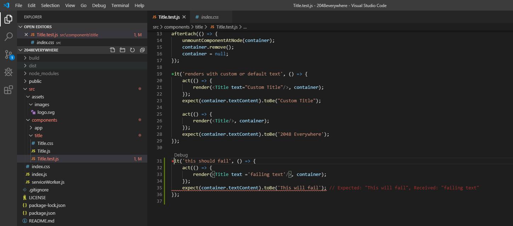

## 2048 Everywhere
This is a project with the goal of creating a reusable set of code to build, run, and distribute the game 2048 accross the web, Linux, Mac, Windows, Android, and iOS.

## Setup
Make sure to run "npm install" after cloning the repository to install necessary dependancies.

## Visual Studio Code Extensions
If using Visual studio code the following extension(s) are recommended:

Jest: https://marketplace.visualstudio.com/items?itemName=Orta.vscode-jest

This allows you to see passing/failing tests within the workspace and within the open editor. It will run the tests on the fly as you save files.

## Running Web
To run use the command "npm run start" and the local server will spin up and a web page will be loaded in your default browser.

## Running Desktop
To run use the command "npm run electron-start" and the electron app will launch.

## Distributing Desktop
To distribute the desktop application use the command "npm run electron-pack" this will build and package the app under the dist folder. At the moment the arguments will only build the app for the platform you're currently on.
